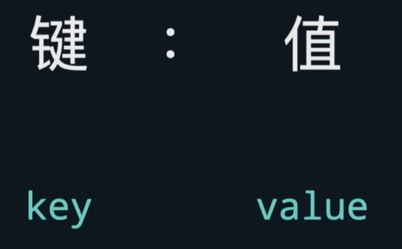

```python

# 定义
contacts = {
    "小明" : "138000"
   	"小工" : "138100"
}

#使用元组定义
contacts = {
    ("小明", 23) : "138000"
   	("小明", 24) : "138100"
}


# 取值
idde = contact["小明"]


#添加元素
contacts["小王"] = "1381100"

# 键的类型不可变

```


