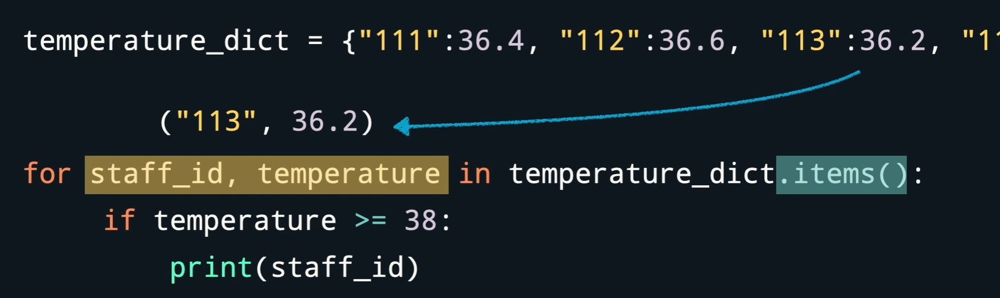

```python


#可以对列表，字典，字符串
for 变量名 in 迭代对象 ：


```


```python
字典名.keys()  #所有键
字典名.values()  #所有值
字典名.items()  #所有键值对
```




```python

range(1,10)
整数数列，左闭右开

range(1,10，2)
每次跨两个数字
1， 3，5，7，9

```


