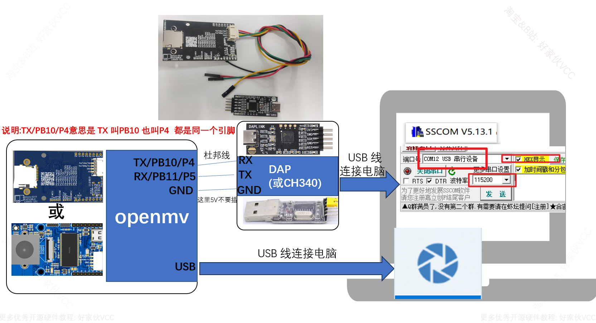

## 串口

OpenMV4 H7 Plus， OpenMV4 H7， OpenMV3 M7 的串口UART（1）是P0-RX P1-TX。

OpenMV4 H7 Plus， OpenMV4 H7， OpenMV3 M7， OpenMV2 M4 的串口UART（3）是P4-TX P5-RX


第一张图

b'\xe8\x8b\xb9\xe6\x9e\x9c\n  苹果  1

\xe8\x8b\xb9\xe6\x9e\x9c\n      苹果

\xe6\xa2\xa8\xe5\xad\x90\n      梨子  2

\xe6\xa2\xa8\xe5\xad\x90\n       梨子

\xe8\x8b\xb9\xe6\x9e\x9c\n       苹果

\xe6\xa2\xa8\xe5\xad\x90\n      梨子

\xe8\x8b\xb9\xe6\x9e\x9c\n      苹果

\xe6\xa2\xa8\xe5\xad\x90'          梨子


b'\xe8\x8b\xb9\xe6\x9e\x9c\n\xe8\x8b\xb9\xe6\x9e\x9c\n\xe6\xa2\xa8\xe5\xad\x90\n\xe6\xa2\xa8\xe5\xad\x90\n\xe8\x8b\xb9\xe6\x9e\x9c\n\xe6\xa2\xa8\xe5\xad\x90\n\xe8\x8b\xb9\xe6\x9e\x9c\n\xe6\xa2\xa8\xe5\xad\x90'


第二张图

b'\xe8\x8c\x84\xe5\xad\x90\n          茄子   1

\xe5\x8d\x97\xe7\x93\x9c\n             南瓜 2 

\xe8\xa5\xbf\xe7\xba\xa2\xe6\x9f\xbf\n      西红柿 3

\xe8\xbe\xa3\xe6\xa4\x92\n          辣椒 4

\xe5\x8d\x97\xe7\x93\x9c\n          南瓜

\xe8\xa5\xbf\xe7\xba\xa2\xe6\x9f\xbf\n        西红柿

\xe8\x8c\x84\xe5\xad\x90\n           茄子

\xe8\xbe\xa3\xe6\xa4\x92\n            辣椒

4,3,1,10,8,9,2,11'          位置


b'\xe8\x8c\x84\xe5\xad\x90\n\xe5\x8d\x97\xe7\x93\x9c\n\xe8\xa5\xbf\xe7\xba\xa2\xe6\x9f\xbf\n\xe8\xbe\xa3\xe6\xa4\x92\n\xe5\x8d\x97\xe7\x93\x9c\n\xe8\xa5\xbf\xe7\xba\xa2\xe6\x9f\xbf\n\xe8\x8c\x84\xe5\xad\x90\n\xe8\xbe\xa3\xe6\xa4\x92\n4,3,1,10,8,9,2,11'


```python
from pyb import UART
import ustruct

#初始化串口
uart = UART(3,115200,bits=8, parity=None, stop=1, timeout_char = 1000)#初始化串口三、波特率115200 TXD:P4\PB10 RXD:P5\PB11

#定义一个串口发送函数
def send_five_uchar(c1,c2,c3,c4,c5):
    global uart;
    data = ustruct.pack("<BBBBBBBB",#使用了 ustruct.pack() 函数将这些数据打包为二进制格式。使用 "<BBBBBBBB" 作为格式字符串来指定要打包的数据的类型和顺序：
                   0xA5,
                   0xA6,
                   c1,
                   c2,
                   c3,
                   c4,
                   c5,
                   0x5B
                   )
    uart.write(data);#uart.write(data) 将打包好的二进制数据帧写入 UART 发送缓冲区，从而将数据通过串口发送出去
    print(data)#通过 print(data) 打印发送的数据到串行终端，方便调试和确认发送的内容。

    
    
    
    #下面是使用代码
    #du'b'g
    flag = [0,0,0,0,0]
    
    
    
	#最后使用发送函数
    send_five_uchar(flag[0],flag[1],flag[2],flag[3],flag[4])#把五个数据通过串口发送出去、发送五个无符号字符。
```


## 调试


```python
# 原始数据
group1_items = ['1', '2', '3', '4', '2', '3', '1', '4']
group2_str = "4 3 1 10 8 9 2 11"

# 初始化串口
uart = UART(3, 115200, bits=8, parity=None, stop=1, timeout_char=1000)

# 发送函数（每次发送5字节数据）
def send_five_uchar(c1, c2, c3, c4, c5):
    data = ustruct.pack("<BBBBBBBB",
                       0xA5, 0xA6,
                       c1, c2, c3, c4, c5,
                       0x5B
                       )
    uart.write(data)
    print("Sent:", data)

# 处理数据
def split_data(data_list, chunk_size=5):
    batches = []
    for i in range(0, len(data_list), chunk_size):
        batch = data_list[i:i+chunk_size]
        batch += [0] * (chunk_size - len(batch))  # 补零填充
        batches.append(batch)
    return batches

# 转换并分割数据
group1 = [int(x) for x in group1_items]
group2 = list(map(int, group2_str.split()))

# 分两次发送（每组数据分两次，共四次发送）
group1_batches = split_data(group1)
group2_batches = split_data(group2)

# 发送group1的两批数据
print("发送 Group1 数据：")
for batch in group1_batches:
    send_five_uchar(*batch)

# 发送group2的两批数据
print("\n发送 Group2 数据：")
for batch in group2_batches:
    send_five_uchar(*batch)
```


## 接线




```python
 #B区二维码
        # 按换行符分割字节串（去除空项）
        items = [item for item in chuli.split(b'\n') if item]

        # 映射字典定义
        mapping = {
            b'\xe8\x8b\xb9\xe6\x9e\x9c': '1',  # 苹果 -> 1
            b'\xe6\xa2\xa8\xe5\xad\x90': '2'   # 梨子 -> 2
        }

        # 处理每个字节片段并重组
        result = '\n'.join([mapping.get(item, '') for item in items])

        # 输出结果
        print(result)

```


## 接收数据

```python
import time, image,sensor,math,pyb,ustruct
from image import SEARCH_EX, SEARCH_DS
from pyb import LED

#从imgae模块引入SEARCH_EX和SEARCH_DS。使用from import仅仅引入SEARCH_EX,
#SEARCH_DS两个需要的部分，而不把image模块全部引入。


sensor.reset()

# Set sensor settings
sensor.set_contrast(1)
sensor.set_gainceiling(16)
# Max resolution for template matching with SEARCH_EX is QQVGA
sensor.set_framesize(sensor.VGA)
# You can set windowing to reduce the search image.
sensor.set_pixformat(sensor.RGB565)


rx_buff=[]
state = 0
tx_flag = 0

x = 0

Find_Task =1       #1
Target_Num =0
data = [0x00,0x00,0x00,0x00,0x00,0x00,0x00,0x00,0x00]


uart = pyb.UART(3, 115200, timeout_char = 1000)     #定义串口1变量
led =LED(2)


clock = time.clock()
# Run template matching
while (True):

    clock.tick()
    img = sensor.snapshot()# 镜头初始化
    if(uart.any()>0):
       temp = uart.read(3)
       if(temp[0] == 49):
        led.on()
        print(temp[0])


```


