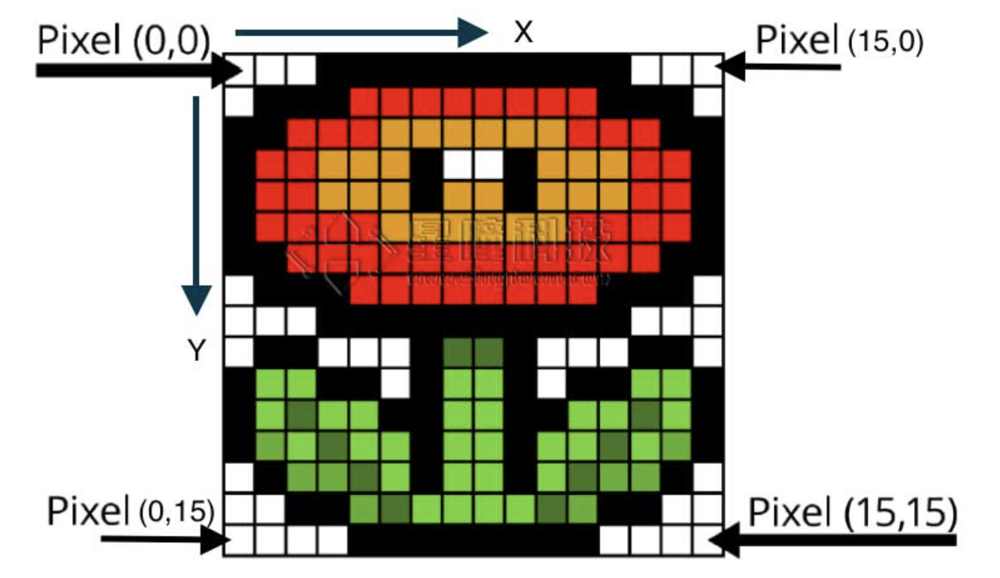
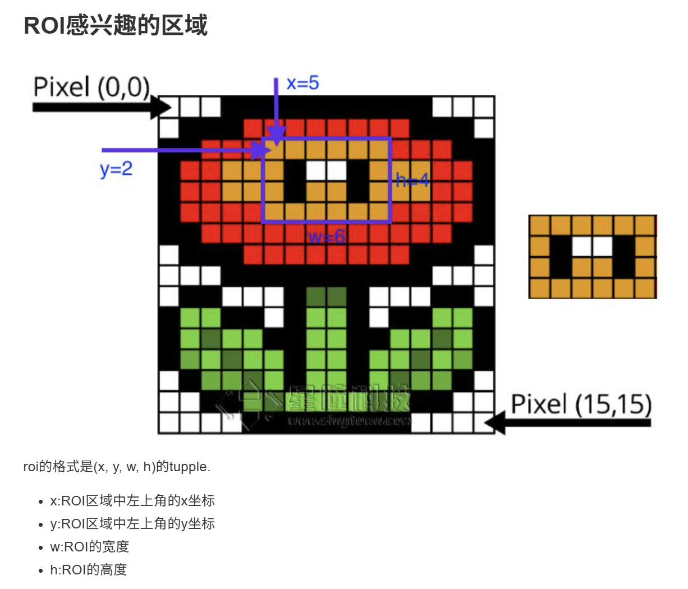
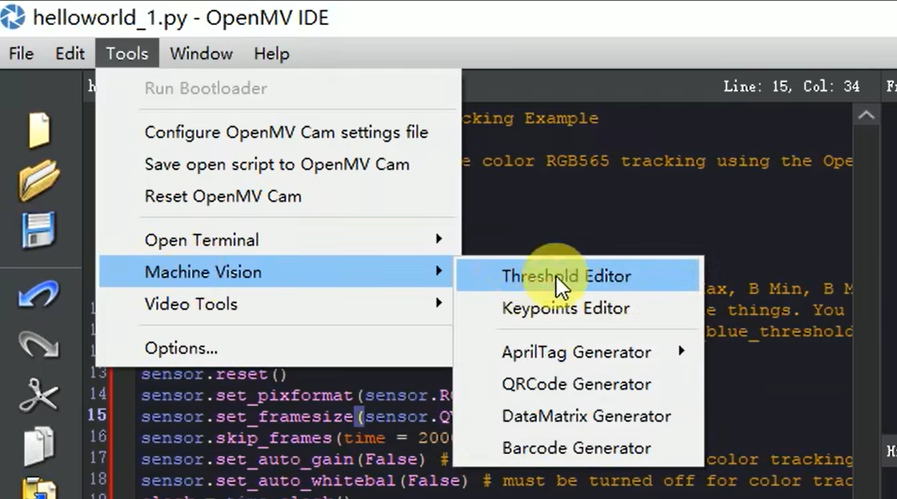

- image.get_pixel(x, y)
  - 对于灰度图: 返回(x,y)坐标的灰度值.
  - 对于彩色图: 返回(x,y)坐标的(r,g,b)的tuple.


- image.set_pixel(x, y, pixel)
  - 对于灰度图: 设置(x,y)坐标的灰度值。
  - 对于彩色图: 设置(x,y)坐标的(r,g,b)的值。




会忽略比w和h小的色块


```python
import sensor, image, time

sensor.reset() # 初始化摄像头
sensor.set_pixformat(sensor.RGB565) # 格式为 RGB565.
sensor.set_framesize(sensor.QVGA)
sensor.skip_frames(10) # 跳过10帧，使新设置生效
sensor.set_auto_whitebal(False)               # Create a clock object to track the FPS.

ROI=(80,30,15,15)

while(True):
    img = sensor.snapshot()         # Take a picture and return the image.
    statistics=img.get_statistics(roi=ROI)
    color_l=statistics.l_mode()
    color_a=statistics.a_mode()
    color_b=statistics.b_mode()
    print(color_l,color_a,color_b)
    img.draw_rectangle(ROI)
```


## 阈值

一个颜色阈值的结构是这样的：

```
red = (minL, maxL, minA, maxA, minB, maxB)
```

元组里面的数值分别是L A B 的最大值和最小值。




